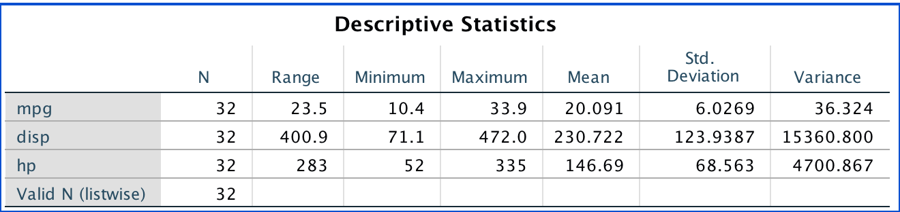

```{r setup, include=FALSE}
knitr::opts_chunk$set(echo = TRUE)
library(knitr)
library(kableExtra)
```

## General Information

- Lab instructor: Carter Allen, 2nd year PhD student in biostatistics
- email: allecart@musc.edu
- Lab times: Th 4:00-5:00 PM 
- Lab locations: 135 Cannon St. Rm 301
- Lab webpage: https://carter-allen.github.io/methods1-f18/

## Introduction to Biostatistics

> "We have the duty of formulating, of summarizing, and of communicating our conclusions, in intelligible form, in recognition of the right of other free minds to utilize them in making their own decisions." - Ronald Fisher

Introduction to Clinical Biostatistics (a.k.a Methods 1) is an introductory course to biostatistics - the field that deals with the application of statistical methods and theories to the life sciences. Biostatistics seeks to formalize and quantify the scientific method by providing tools that allow for _inductive reasoning_. In contrast to _deductive reasoning_, where specific inferences are drawn from a more general theorem, inductive reasoning relies on observations (data) to arrive at more general theorems. With statistics, we can use data to better understand a given process, generate hypotheses regarding that process in general, and test the validity of our hypotheses against what we observed. We will work through this general framework over the course of the semester. 

## About this Lab Section

The lab section of this course is meant to reinforce the topics learned in the lecture through examples that are relevant to what has been discussed in class. In the lab section, you will gain practice with skills that will be tested on homework and exams. The lab section will not consist of any PowerPoint lectures. Instead we will use lab time to work through examples that mimic how your homework is to be done. As your TA, I will work with you on a group and an individual basis to resolve any issues you may have. I will also demonstrate how to use statistical software during labs. While we will make extensive use of statistical software in this class, it is important to remain focused on the concepts being taught. The computational aspect of this class is only a means to an end, which is general statistical reasoning. 

Each week I will generate handouts similar to this one, which will serve as a template for that week's lab. They will be located [here](https://carter-allen.github.io/methods1-f18/). You are encouraged to review these handouts before lab and familiarize yourself with the day's agenda. If you feel that you can work through the labs yourself you are free to complete them from home or not at all. There are no graded lab assignments. The purpose of lab is to aid in your conceptual and practical understanding of the material presented during lecture. With that said, there are still some important ground rules.

- I will not do the homework for you in lab section. However, the examples we work through during labs will be germane to what is asked on the homework. I will strive to write the labs in such a way that if you can do the labs, you can do the homework. 

- Outside of lab, feel free to email me with questions at allecart@musc.edu. Please be courteous with emails. 

- As a graduate student, you are expected to become proficient in technical writing, the medium in which science is conducted. You will be introduced to a new rhetorical tool in this class, statistics, which is a primary component of most scientific writing. With this in mind, I encourage you to think of this class (and any other statistical situation you encounter) as an exercise in scientific persuasion. You should be drawing on your knowledge of statistical principles to construct a valid and persuasive argument for what you think is the appropriate inference (if any) to be made from a set of quantitative evidence. 

- With the above point in mind, all homework assignments should be primarily composed of your interpretations and justifications of the statistical methods used. For any graph, table, figure, or calculation, you must provide an interpretation of what you present. No credit will be given for "raw" or "naked" computer output.

- You are free to consult me, your classmates, or other instructors with questions on homework or the material presented in class. However, each student must submit their own homework. 

## SPSS

For this class, we will use IBM's SPSS (Statistical Package for the Social Sciences). This software will run on Windows, macOS, and Linux, so it should not matter what type of computer you use. In general, I will do my best to use universally compatible file formats and avoid proprietary software (while SPSS is proprietary, you are given a free copy by MUSC).

Follow the steps below to install SPSS on your computer. 

- Visit the MUSC IT page [here](https://academicdepartments.musc.edu/information%20solutions/itlinks)
- Log in with your NetID and password
- Scroll down the page until you find the listings for SPSS. Choose the macOS or Windows link as appropriate.
- You'll be taken to a webpage with several different versions of SPSS. Choose the first version (v25) and keep the page open as you will need that authorization code. 
- Follow the SPSS installation wizard and copy/paste the authorization code over when requested. 

Upon opening SPSS, you are presented with the option to either import data from an existing file, or manually enter data into a spreadsheet interface. This feature works much like Microsoft Excel. Indeed SPSS can be thought of as a spreadsheet software with a wide variety of statistical procedures available through a GUI (graphical user interface, i.e. "point and click"). SPSS is only one of many statistical packages used by researchers, with languages such as `R` and SAS being preferred by many statisticians. 

When using SPSS, it is important to note that the software exists to expedite statistical procedures and calculations, not to serve as an inference machine. It is your job to use SPSS to produce the figures, tables, and graphics that will form the foundation for your statistical inference. Once again, submission of raw SPSS output with no accompanying interpretation of your own will receive no credit. 

## Basic Terminology

Before we get into our first lab, I will introduce some basic terminology that will allow you to speak the language of statistics. 

___Data___ are information aggregated in some organized form. Data can consist of numbers, characters, words, images, etc... It is important to recognize that data are hardly ever objective (the term "raw data" is an often used [oxymoron](https://mitpress.mit.edu/books/raw-data-oxymoron)). Data are collected by humans (or by computers programmed by humans) and thus are always subject to biases and imprecision. It is a primary goal of statistics to identify and quantify these imperfections in data. We generally think of data as being defined by _observations_ on a set of _variables_.

A ___variable___ is some trait or characteristic that we wish to measure. Some examples of variables often encountered in clinical settings are birthweight, age, sex, and blood pressure. An ___observation___ is a set of realizations of variables on a single experimental unit. For example, if we were collecting data on the socio-economic status of a certain community, some variables of interest might be income, race, and education. An observation would be the income, race, and education of one person, where the person is our unit of observation. Again, note that variables need not be numbers. 

The table below shows a classic pedagogical data set, known as `mtcars`. Technical specifications of several (old) cars are related to the cars' fuel efficiency rating in miles per gallon. In this case, the variables are `mpg`,`cyl`,`disp`, and the rest of the column headers. The observations are the collection of values of these variables associated with each car in the data set. Here, the individual car is the unit of observation. 

```{r,echo=FALSE}
data("mtcars")
kable(head(mtcars),caption = "A selection from the famous mtcars data") %>% kable_styling(bootstrap_options = c("stripped","hover"))
```

In general, but certainly not always, we organize data with variables as columns and observations as rows. 

The term ___statistic___ simply means a mathematical function of data. Some common statistics include the mean, median, variance and standard deviation. As you might expect, we will see many examples of statistics in this course of varying complexity. Different statistics are defined to characterize different attributes of data. 

## Lab

This first lab will simply aquatint you with getting data into SPSS and calculating various statistics. 

### Import data

Locate the `mtcars` data set on the [lab webpage](https://carter-allen.github.io/methods1-f18/). You will be downloading a CSV file called `mtcars.csv`. CSV stands for "comma separated value" and is an indication that each value in the file is delimited by a comma. I encourage you to open `mtcars.csv` in a plain text editor (Notepad on Windows or TextEdit on Mac) to see this for yourself. After downloading this file from the web, place it in a directory on your computer where that makes sense for you. I personally would have a folder for Methods 1 containing a sub-folder for Labs, containing sub-folders for each lab session, but of course you are free to organize your files for this course however you like.

Now, open SPSS and close any start-up message windows. You should be looking at a blank spreadsheet such as the one shown below. 


Navigate to __File__ $\rightarrow$ __Import Data__ $\rightarrow$ __CSV Data__. Use the file navigation window to select the `mtcars.csv` file wherever it is located on your computer. After accepting the default options, you should now have a spreadsheet populated with the `mtcars` data. 


You can save this new data set in your lab directory by navigating to __File__ $\rightarrow$ __Save As__.

### Descriptive Statistics

For the variables `mpg`, `hp`, and `disp`, let's calculate the following descriptive statistics.

- Mean
- Median
- Range
- Standard Deviation
- Variance

We will do this for both the overall data, and for each group of cars based on cylinder size. 

To gather simple descriptive statistics navigate to __Analyze__ $\rightarrow$ __Descriptive Statistics__ $\rightarrow$ __Descriptives__. You'll see a dialogue box that looks like this.


Select each of the three variables by clicking on each and then clicking on the middle arrow to add them to the variables list. Once all three variables are in the list, click on __Options__ and select the desired statistics. Clicking __Continue__ should return the table of summary statistics.



Now, to create a summary statistics table grouped by number of cylinders, navigate back to the data spreadsheet by clicking __Go To Data__ in the toolbar. Next, navigate to __Data__ $\rightarrow$ __Split File__. You should see this menu.


Select the bubble for _Compare groups_ and then add `cyl` to the _Grouped based on_ box. Clicking OK will give the desired table.


### Discussion 

What do you notice about the relationship between each variable (miles per gallon, displacement, horsepower) and number of cylinders? 
