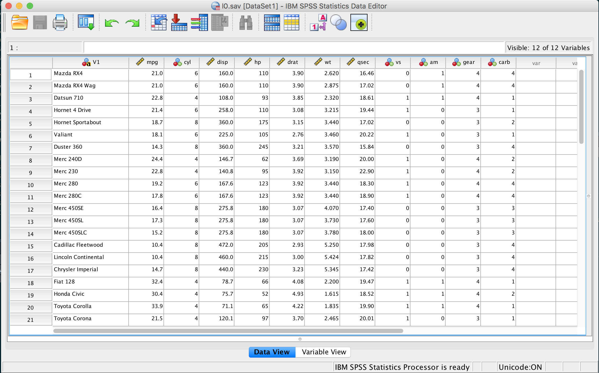
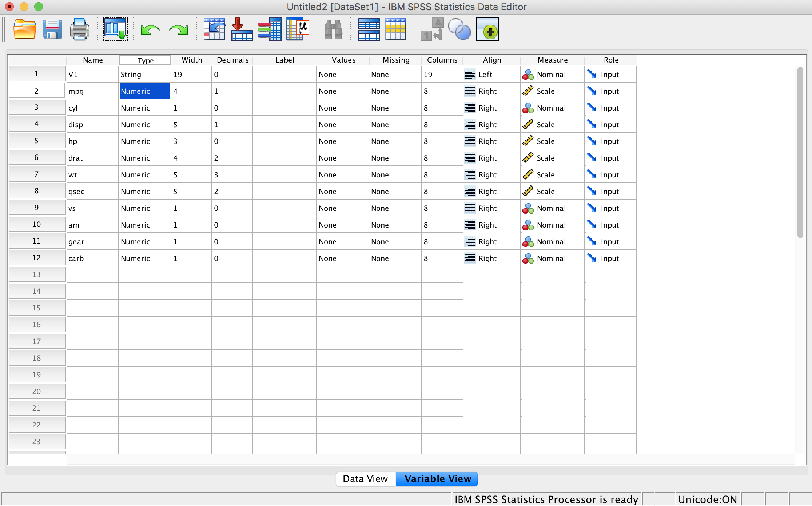
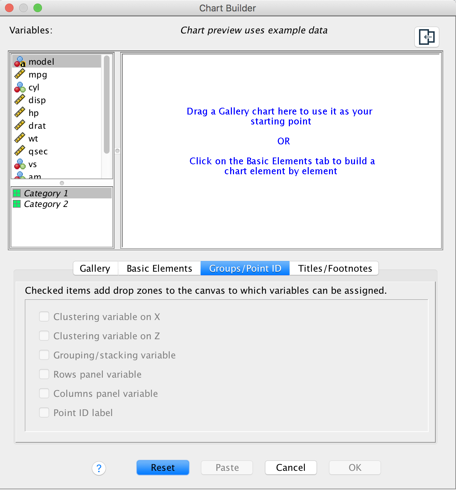
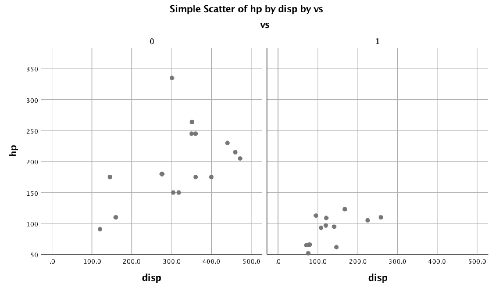
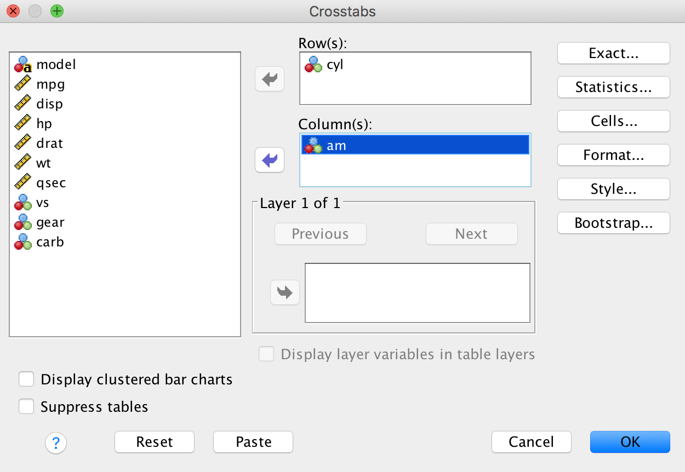
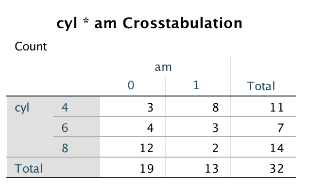
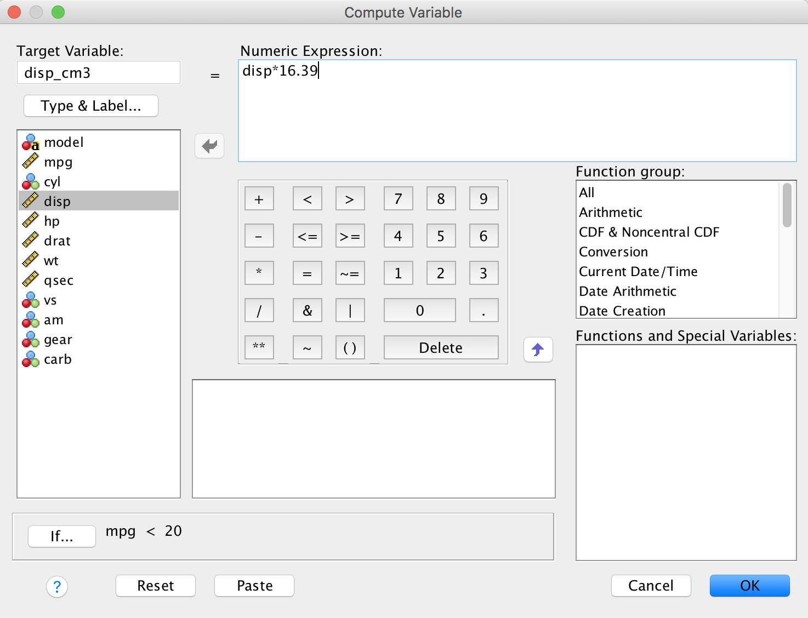
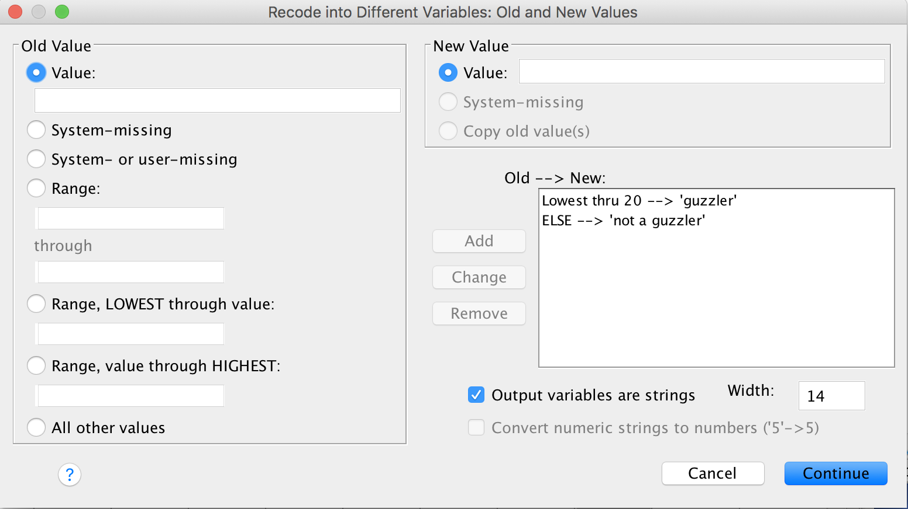

```{r setup, include=FALSE}
knitr::opts_chunk$set(echo = FALSE)
library(knitr)
library(kableExtra)
library(shiny)
library(tidyverse)
```

## Variable Types

In the last lab we discussed how data are generally organized as a collection of observations each made on a set of variables. As you can imagine, there are many different types of variables we can collect. The types of variables in a data set will dictate how we display data and what statistical procedures are appropriate. Thus, it is essential that you are able to identify and understand the types of variables in the data you work with. 

### Numeric

Not surprisingly, numeric variables are those that take on values that are numbers. Your age and height are both numeric variables, but your first name is probably not. There are two basic types of numeric variables.

1) ___Continuous numeric___ variables are those that can take on an infinite number of values between two points. If you are wondering whether a variable is continuous numeric, pick two points and ask yourself if it makes sense to observe a value halfway between those two points. How about a quarter of the way? An eighth? If you ever answer no in this rhetorical exercise, the variable is probably not continuous numeric. Some examples of continuous numeric variables include time, density, and distance. 

2) ___Discrete numeric___ variables are not infinitely divisible - that is, they eventually break down into discrete chunks. The number of pets you have is (should) be discrete. 

_Question_: Can you think of some variables that can go either way? How about age?

### Categorical

Categorical variables consist of distinct levels, or categories, but need not be numeric. There are two general sub-types of categorical variables. 

1) ___Ordinal___ variables are categorical variables with a natural ordering. The names used to classify undergraduate students based on their number of years in school; Freshman, Sophomore, Junior, Senior, have a natural ordering to them. 

2) ___Nominal___ variables are categorical variables with no natural ordering. It would not make sense to order variables like hair color, of favorite genre of music. 

We refer to each individual category of a categorical variable as a ___level___. 

_Question_: What is the difference between an ordinal categorical variable and a discrete numeric variable?

### Exercise

Recall the `mtcars` data, which contains the 1974 Motor Trend magazine's reported specifications of 32 cars. The first few cars are displayed below. Use your best judgement to infer what the variable names refer to, and identify the type of each variable as one of the four types discussed above. 

```{r,echo=FALSE}
data("mtcars")
kable(head(mtcars),caption = "A selection from the famous mtcars data") %>% kable_styling(bootstrap_options = c("stripped","hover"))
```

As we did in the last lab, load the `mtcars.csv` file into SPSS. You should be presented with the spreadsheet view of the mtcars data as shown below. 



On the bottom of the screen, locate the _Variable View_ button and click it to enter the variable view. You should see a page like this. 



In the Measure column is displayed the variable types we have discussed so far. Note that SPSS uses the term ___scale___ where we have been using continuous numeric. SPSS will let you change the measure type by clicking on each cell. 

While we are here, let's give the first variable, which indicates the make and model of the car, a better name (as of now it is just called `V1` since there was no column header for this column in the `mtcars.csv` file). We can do this by double clicking on the variable name `V1` while in the variable view mode. What you name your variables is up to you, but in general it is good practice to avoid spaces in variable names.

## Visualizing Data

> "The greatest value of a picture is when it forces us to notice what we never expected to see." - John Tukey (1977) _Exploratory Data Analysis_

Perhaps one of the most powerful tools in data analysis is data visualization. It is an enormous field, with [tons of books](https://www.amazon.com/s?url=search-alias%3Dstripbooks&field-keywords=data+visualization&sprefix=data+vis%2Caps%2C300&crid=HJA0D5B0QTWH) written on the subject. Visualizing data, when done correctly, can reveal underlying trends that were not obvious before, and can be used to generate new hypotheses. Unfortunately, it is possible to use data visualization to mislead your audience, as is the case with any rhetorical tool. For example, this [infamous climate change graph](https://www.washingtonpost.com/news/the-fix/wp/2015/12/14/why-the-national-reviews-global-temperature-graph-is-so-misleading/?noredirect=on&utm_term=.03e3cf40bf3b) shown below is misleading in many ways. Can you identify one misleading aspect of this graph?


Before getting into the best practices for data visualization, let's first look at some the different kinds of visualizations possible. 

### Displaying Numeric Data

In this class, we will most often be visualizing numeric data, both continuous and discrete. Below are two commonly used graphics for displaying numeric data.

1) The ___histogram___ is used to plot one continuous numeric variable. The histogram breaks up the total range of the variable into distinct bins, where the bins are placed along the x axis. Then, the frequency or count of the number of observations falling into each bin is plotted on the y axis. As the number of bins increases (i.e. the width of each bin decreases), the histogram begins to approximate the ___density curve___, which is a "smoothed" histogram plotted continuously. Shown below is a histogram with its corresponding density curve plotted for a large sample from a continuous numeric random variable. Try increasing the number of bins in the input box and watch how the histogram begins to estimate the density curve. 

```{r}
shinyApp(

  ui = fluidPage(
    numericInput("bins","Number of Bins",10,min = 0,max = 1000),
    plotOutput("hist")
  ),

  server = function(input, output) {
    output$hist = renderPlot({
      X = rnorm(10000)
      ggplot2::ggplot() + geom_histogram(aes(x = X, y = ..density..),bins = as.numeric(input$bins)) + xlab("Continuous numeric random variable") + scale_x_continuous(limits = c(-5,5)) + geom_line(aes(x = X,y = ..density..), color = "cadetblue",stat = 'density') 
    })
  },
  options = list(height = 500)
)
```

2) The ___bar chart___ is used to plot one discrete numeric variable. Similarly to the histogram, the unique values are plotted on the x-axis and the corresponding counts or frequencies of the discrete variable are plotted on the y-axis. Note that with bar charts we don't need to worry about bins, because the data are already discrete. Below is bar chart showing for the `cyl` variable (number of engine cylinders) in the `mtcars` data.

```{r,fig.align='center'}
ggplot(data = mtcars) + geom_bar(aes(x = cyl)) + scale_x_continuous(breaks = c(4,6,8))
```

> "This is my favorite part about analytics: Taking boring flat data and bringing it to life through visualization." - John Tukey

3) The ___scatter plot___ is used to plot two continuous numeric variables. In the scatter plot, one variable is assigned to the x-axis and the other to the y-axis. Points are then plotted on the Cartesian coordinate system. Below is a scatter plot from the `mtcars` data showing the displacement of a car's engine in cubic inches on the x-axis and the engine's horsepower on the y-axis. Do you notice anything about the relationship between engine size and horsepower?

```{r,fig.align='center'}
ggplot(data = mtcars,aes(x = disp, y = hp)) + geom_point()
```

4) The ___box plot___ is used to plot summary statistics of one continuous numeric variable on the y-axis and either a discrete numeric, or categorical variable on the x-axis. The bottom of the box represents the 25th percentile, the middle line represents the median, and the top of the box represents the 75th percentile. Below is a boxplot of engine displacement vs. number of cylinders.

```{r,fig.align='center'}
ggplot(data = mtcars,aes(x = as.factor(cyl), y = mpg)) + geom_boxplot() + xlab("cylinders")
```


### Displaying Categorical Data

To visualize categorical data, we often use ___contingency tables___, which are often 2x2 tables giving the number of occurrences at each combination of the levels in the categorical variables. Contingency tables are not always 2x2 though, they can have as many rows or columns and there are levels of the categorical variables. Below is a contingency table for a data set of 50,000 diamonds, where the variables in the table are diamond cut and clarity rating. Both are ordinal variables displayed in order of worst to best.

```{r}
data("diamonds")
kable(table(diamonds$cut,diamonds$clarity),caption = "Contingency table for diamonds data") %>% kable_styling(bootstrap_options = c("stripped","hover"))
```

## Visualization in SPSS

All the plots that you have seen so far can be constructed in SPSS. To plot data in SPSS, we will primarily use the Chart Builder utility accessible by navigating to __Graphs__ $\rightarrow$ __Chart Builder__. Once in the chart builder you can choose a chart type such as histogram, bar chart, scatter plot, etc... Once you have chosen a chart type, simply drag the desired variables from your data to the appropriate axis. For histograms and bar charts, you will have only one variable. For scatterplots and boxplots you will have two variables. You can even add a third variable for ___faceting (grouping)___. As an example, let's look at how to build a grouped scatter plot, where we will display the relationship between displacement (x-axis) and horesepower (y-axis) for both "V" and "non-V" engines (this is just a designation of how the cylinders are arranged in the engine). 

Open the chart builder as described above. You should see a blank chart builder like the one shown below. If your chart builder is already populated with a chart simply click Reset. 



Select the scatterplot template from the Gallery by dragging it to the chart builder area. Drag `disp` to the x-axis and `hp` to the y-axis. To add grouping variables, click the Groups/Point ID tab and then select Columns panel variable. Now drag the `vs` variable to the column grouping position. Clicking OK should return this plot.



To generate contingency tables, we will use a the Crosstabs function, which can be found by returning to the spreadsheet view in SPSS and navigating to __Analyze__ $\rightarrow$ __Descriptive Statistics__ $\rightarrow$ __Crosstabs__. You can then drag one categorical (or discrete numeric) variable to the rows box and another to the columns box. To creat a contingency table of number of cylinders vs. transmission (automatic or manual) we can set up to crosstabs window like this.



Clicking OK should return the following table. 



## Derivied Variables in SPSS

The term ___derived variable___ is used to refer to any variable that was not present in the original data set, but is defined and computed in terms of the original variables in the data set. Categorical variables are often derived from numeric variables for various analytic purposes. For example, in a data set with a numeric `age` variable, we might want to define a new variable `age_cat` which categorizes `age` into two (or more). One such dichotomization might be minor (age < 18 years) and adult (age $\ge$ 18 years). Another common scenario for deriving variables of your own is when you need to convert between units. For instance, you might have a temperature variable in C you wish to converty to F. We will walk through an example of dichotomizing and converting to different units below.

Let's say we wanted to convert the displacement variable (currently in cubic inches) to cubic centimeters. Google will happily inform you that $1 \ in^3 \approx 16.39 \ cm^3$. So, our new displacement variable will be derived by taking each of the original displacements and multiplying them by 16.39. To do this in SPSS, navigate to __Transform__ $\rightarrow$ __Compute Variable__. In the box beneath Target Variable, type the name of the new target variable. I named it `disp_cm3` here. The, from the list of variables in the `mtcars` data on the left, select `disp` and move it to the Numeric Expressions box by clicking the right arrow. Now, multiply `disp` by 16.39 using your keyboard or the arithmetic operator buttons on the screen. Your window should look like this. If it does, click OK. 



Check the spreadsheet view to make sure the new variable is there. Next, say we wish to define another derived variable that summarizes whether or not a vehicle is a gass guzzler. Our rule for this will be to consider every car that gets less than 20 mpg a gas guzzler, so the new variable will be categorical (nominal), with levels "guzzler" and "not a guzzler" for cars that get < 20 mpg and $\ge$ 20 mpg, respectively. To accomplish this, go to __Transform__ $\rightarrow$ __Recode into different variable__. Note that selecting __Recode into same variable__ would overwrite the original `mpg` variable. We first need to select the input variable, which in this case is `mpg`. Select `mpg` from the list and use the right arrow to move it to the Numeric Variable --> Output Variable box. Now we have to tell SPSS what to call the new variable. In the Output Variable box, enter the name of the new variable into the Name field. I chose `mpg_cat` as the new variable. Click Change. Now we have to explain our recoding rule to SPSS. Click on the Old and New Values... button. In the Old value pane on the left, select the Range, LOWEST through value option and enter 20 as our cutpoint. In the bottom right, select the Output variables are strings option. This tells SPSS that the new variable will be character data. For the width, enter 14 (any number will do as long as it's more than the length of "not a guzzler"). Then type "guzzler" into the Value box within the New Value pane and click Add. Finally, select the All other values bubble under the Old Value pane and enter "not a guzzler" into the Value box. Once your window looks like the one shown below, click Continue then OK on the remaining pop-up.



Within the spreadsheet view, verify that the two new variables are present and have been derived correctly. 

## Lab 

Use SPSS and the `mtcars` data to construct the following plots.

1) Histogram of the miles per gallon variable with 10 bins (Hint: look for the Set Parameters button to specify bins)
2) Scatterplot of displacement (x-axis) vs. miles per gallow (y-axis)
3) Grouped scatterplot of displacement (x-axis) vs. miles per gallow (y-axis) for each number of cylinders (grouping variable).
4) Boxplot of horsepower for each number of cylinders.

Now derive a new variable that converts weight (currently in thousands of lbs) to tons. Calculate the following summary statistics of weight in tons for each group of number of cylinders. Refer to the previous lab to see how grouped summary statistics are computed.

1) Mean
2) Median
3) Standard deviation

What do you notice about the weight of the cars in the different cylinder groups? Is the variability comparable between groups?

Finally, construct a contingency table between the `am` variable (automatic or manual transmission) and the `gear` variable (number of forward gears).