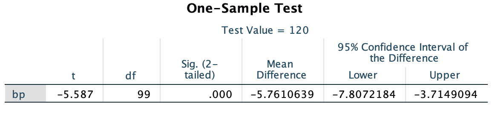

```{r setup, include=FALSE}
knitr::opts_chunk$set(echo = TRUE)
```

## Tests for One Population

When data are collected from a single population, we can test if the mean of the population is equal to a certain hypothesized value. We will make use of the same facts we used for confidence intervals to test hypotheses about means. 

Let $X_1,X_2,...,X_n$ be a random sample of size $n$ from a population with mean $\mu$ and variance $\sigma^2$. From our sample, we calculate $\bar{X} = \frac{\sum x_i}{n}$ and $s^2 = \frac{\sum (x_i - \bar{x})^2}{n-1}$ and use them to estimate $\mu$ and $\sigma^2$, respectively. We know that

$$Z = \frac{\bar{X}-\mu}{\sigma/\sqrt{n}} \sim N(0,1)$$

$$t = \frac{\bar{X}-\mu}{s/\sqrt{n}} \sim t_{df = n-1}$$

We define a set of hypotheses $H_0: \mu = \mu_0$ and $H_A: \mu \ne \mu_0$, and compute a $Z$ or $t$ test statistic depending on whether or not we know $\sigma^2$. If this test statistic results in an extreme value under the assumption of $H_0$ then we reject $H_0$ in favor of $H_A$.

### Example in SPSS

Use the [data](https://carter-allen.github.io/methods1-f18/one-population.csv) on the course webpage titled `one-population.csv`. This file contains data collected on the blood pressure of a certain population. Say we wish to test the following hypotheses.

$$H_0: \mu = 120$$

$$H_A: \mu \ne 120$$

Once the data are in SPSS, navigate to __Analyze__ $\rightarrow$ __Compare Means__ $\rightarrow$ __One Sample T Test__. Select the blood pressure variable and input your hypothesized null mean (120) in the "Test Value" box. The dialogue window should look like this. 

```{r, echo=FALSE, out.width="50%"}
library(knitr)

```

The output given by this procedure includes a p-value (called "Sig" in SPSS) for this test, among other things. As you can see from the SPSS output below, the p-value of approximately $0$ indicates strong evidence against $H_0$.

```{r, echo=FALSE, out.width="50%"}

```

## Paired data

Instead of one set of measurements taken from a population, we may be interested in testing for differences in paired data. In this this case, we have two measurements for each subject and we'll test whether the mean difference is equal to a certain value. With paired data, you compute the difference between pairs of observations for each subject and use that variable of differences to test hypotheses. 

### Example in SPSS

Read in the (pre-post blood pressure data)[https://carter-allen.github.io/methods1-f18/pre-post_example.csv] from the webpage into SPSS. The data are in a form that contains a variable for subject id, measurement occasion (time), and blood pressure (measurement). To create a graphical display of paired data, follow these steps.

- __Graphs__ $\rightarrow$ __Chart Builder__. 
- Select the Line graph template
- Drag `time` to the x-axis
- Drag `measurement` to the y-axis
- Under "Groups/Point ID" select "Grouping/stacking variable"
- Drag `id` to the Set color box

The chart builder window should look like this:

```{r, echo=FALSE, out.width="50%"}

```

Now click OK and you should get the following graph. Note I re-scaled the graph with the "Scale to Data" button.

```{r, echo=FALSE, out.width="50%"}

```

Now, to formally test the null hypothesis of a mean difference of 0, we'll reformat the data by going from "long" to "wide" form. Open a blank SPSS spreadsheet along side of your current spreadsheet. Copy the `measurement` values associated with `pre` into a column of this new spreadsheet and copy the `measurement` values associated with `post`into another column of this new spreadsheet. Name these columns appropriately. Your new "wide" data should look like this.

```{r, echo=FALSE, out.width="50%"}

```

Similarly to with one sample, navigate to __Analyze__ $\rightarrow$ __Compare Means__ $\rightarrow$ __Paired Samples T Test__. Drag `pre` and `post` into the dialogue box for Variable 1 and Variable 2, respectively. Click OK and SPSS will return confidence intervals and a p-value for testing the mean difference is 0. 


