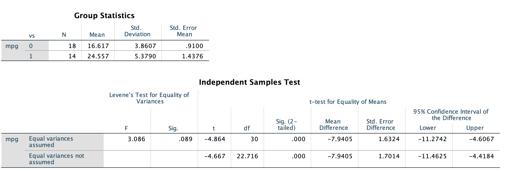

```{r setup, include=FALSE, warning=FALSE, message=FALSE}
knitr::opts_chunk$set(echo = FALSE, warning=FALSE, message=FALSE)
library(tidyverse)
library(knitr)
library(kableExtra)
library(ggplot2)
library(patchwork)
```

## Framework for Two Samples

Previously, our hypothesis tests concerned on sample from a single population. In this basic setting, we collected a sample of size $n$ from some population, and used that sample to ___infer___ what the true parameter is. Remember, a ___parameter___ is a quantity that characterizes a distribution, but is unobservable to us unless our sample is actually a census (i.e. we sample every possible member of the population). Examples of parameters we have been working with so far are $\mu, \sigma^2$, and $p$. Often, we will want to compare two samples, each from a respective population, and determine whether or not the parameters of those two populations are equal based on the information we have in the two samples. Note the important distinction of taking two _independent_ samples from two different populations. This is different from the "pre-post" tests we learned about, which are really just one-sample tests because we make inference based on the one sample of differences within each pair of observations. 

## Visualizing two samples

Imagine we collect two independent samples of sizes $n_1$ and $n_2$ respectively and we are interested in comparing their means and variances. We might display our two samples graphically using any of the following approaches. 

<center>

```{r,fig.cap="Stacked histograms of two independent samples. We can use these to compare the means and variances of the two samples"}
n1 <- 200
n2 <- 350
s1 <- rnorm(n1,4,2)
s2 <- rnorm(n2,-2,4)
p1 <- ggplot() + geom_histogram(aes(x = s1)) + scale_x_continuous(limits = c(min(s2),max(s1))) + xlab("Sample 1")
p2 <- ggplot() + geom_histogram(aes(x = s2)) + scale_x_continuous(limits = c(min(s2),max(s1))) + xlab("Sample 2")
p1 + p2 + plot_layout(ncol = 1)
```

</center>

<center>

```{r,fig.cap="Stacked histograms of two independent samples. We can use these to compare the means and variances of the two samples"}
xs <- c(s1,s2)
sm <- c(rep(1,n1),rep(2,n2))
df <- as.data.frame(cbind(xs,as.factor(sm)))
ggplot(data = df, aes(x = as.factor(sm), y = xs)) + geom_boxplot() + xlab("Sample") + ylab("Response")
```

</center>

The two plots above are examples of ways to visualize two samples. When plotting data from multiple samples, it is best to display the data in such a way as to facilitate easy _comparisons between samples_, encouraging the viewer to think about what the two samples are suggesting about the populations they represent. Note how these plots are different than plots for paired data, as plots for paired data emphasize the connection between individuals in each measurement. 

In SPSS, it is helpful to have your data in ___long form___ when making plots like these, as you are able to specify to SPSS a variable that designates which sample a certain observation comes from. This is opposed to ___wide form___, where each sample occupies its own column. 

<center>

```{r}
wide <- as.data.frame(head(cbind(s1,s2)))
colnames(wide) <- c("Sample 1", "Sample 2")
kable(wide, caption = "An example of a hypothetical data set in wide form. Note that each of the two samples is its own column and there is no separate column designating a sample identification for each observation.",digits = 2) %>%
  kable_styling(bootstrap_options = c("striped", "hover"))
```

</center>

<center>

```{r}
colnames(df) <- c("Observation", "Sample ID")
kable(head(df), caption = "An example of a hypothetical data set in long form. Note that there is one column for all of the observations in both samples and a separate column identifying which sample each observation came from",digits = 2) %>%
  kable_styling(bootstrap_options = c("striped", "hover"))
```

</center>

## Sampling Distributions

In the two sample setting, it will be helpful to identify the statistics from each sample with subscripts. So, instead of a sample of size $n$, we have two samples of sizes $n_1$ and $n_2$, respectively. Likewise, we have two sample means $\bar{x}_1$ and $\bar{x}_2$ and two sample standard deviations $s_1$ and $s_2$.

### Difference of two means, known variances

The most common goal when comparing two samples is to test whether the means of their respective populations are equal. So, a set of hypotheses to test might look like this

$$H_0: \mu_1 = \mu_2 \iff \mu_1-\mu_2 = 0$$
$$H_1: \mu_1 \ne \mu_2 \iff \mu_1 - \mu_2 \ne 0$$

Suppose we know the variance of each of the two populations we are sampling, $\sigma^2_1$ and $\sigma^2_2$.  Recall that the central limit theorem states the regardless of the distribution from which our data were sampled, the sampling distribution of the sample mean will be normal for large samples. The CLT allows us to state the following

$$\bar{X}_1 \sim N  \left ( \mu_1,\frac{\sigma^2_1}{n_1} \right )$$

$$\bar{X}_2 \sim N  \left ( \mu_2,\frac{\sigma^2_2}{n_2} \right )$$

Recall what we know about linear combinations of random variables. Also, it is a fact that the linear combination of normal distributions will also be normal. 

$$E(\bar{X}_1 - \bar{X}_2) = E(\bar{X}_1) - E(\bar{X}_2) = \mu_1 - \mu_2$$

$$Var(\bar{X}_1 - \bar{X}_2) = Var(\bar{X}_1) + Var(\bar{X}_2) - 2Cov(\bar{X}_1,\bar{X}_2)$$
$$= Var(\bar{X}_1) + Var(\bar{X}_2) - 0 = Var(\bar{X}_1) + Var(\bar{X}_2)$$
$$= \frac{\sigma^2_1}{n_1} + \frac{\sigma^2_2}{n_2}$$

Putting this information together, we have that 

$$\bar{X}_1 - \bar{X}_2 \sim N \left (\mu_1 - \mu_2,\frac{\sigma^2_1}{n_1} + \frac{\sigma^2_2}{n_2} \right )$$

Since we now know the distribution of the difference between the two means, we can now construct a hypothesis test comparing the means from their populations. The usual test of interest is whether or not the two populations have the same mean. In notation, this is expressed as 

$$H_0: \mu_1 - \mu_2 = 0$$
$$H_1: \mu_1 - \mu_2 \ne 0$$

We will form a test statistic $Z$ by taking our point estimate $(\bar{x_1}-\bar{x_2})$ subtracting its expected value, $\mu_1 - \mu_2$, and dividing by its standard deviation $\left (\sqrt{\frac{\sigma^2_1}{n_1} + \frac{\sigma^2_2}{n_2}} \right )$. Remeber, the way to standardize any normal distribution in general to a standard normal (one with $\mu = 0, \ \sigma = 1$) is to subtract the mean and divide by the standard deviation. So, the following is our test statistic

$$Z = \frac{(\bar{x_1}-\bar{x_2}) - (\mu_1 - \mu_2)}{\sqrt{\frac{\sigma^2_1}{n_1} + \frac{\sigma^2_2}{n_2}}} \sim N(0,1)$$

Like in all hypothesis tests, we assume $H_0$ is true and evaluate the "evidence" under this assumption. Under $H_0$, $Z$ reduces to 

$$Z = \frac{(\bar{x_1}-\bar{x_2})}{\sqrt{\frac{\sigma^2_1}{n_1} + \frac{\sigma^2_2}{n_2}}}$$

_Note: you should be able to quickly convince yourself why this is true!_

So, our test of $H_0$ proceeds by computing $Z_{test}$ according to the formula above and either

- Compute a p-value: $p = P(|Z_{test}| \ge Z \ | \ H_0 \ is \ true)$. Reject $H_0$ if $p < \alpha$. Or,
- Compate $|Z_{test}|$ to a critical value $Z_{1-\alpha/2}$. Reject $H_0$ if $|Z_{test}| > Z_{1-\alpha/2}$.

_Note: you should be able to explain why these two approaches are equivalent and why we are using the absolute value!_

### Difference of two means, equal variances

When we do not know the true values of $\sigma^2_1$ or $\sigma^2_2$, we estimate them with $s^2_1$ and $s^2_2$, respectively. As before, making this substitution induces a different distribution of our test statistic, namely the t-distribution. It turns out, that the expression for the $t$ test statistic becomes much simpler if we can make (and defend) the assumption that $\sigma^2_1 = \sigma^2_2$. You will verify this using visual inspection of the two samples (see the plots above) and a formal test for the equality of these variances (more on this soon). The $t_{test}$ statistic assuming $\sigma^2_1 = \sigma^2_2$ is

$$t_{test} = \frac{(\bar{x_1}-\bar{x_2}) - (\mu_1 - \mu_2)}{s_{pooled}\sqrt{\frac{1}{n_1} + \frac{1}{n_2}}} \sim t_{n_1 + n_2 -2}$$

$$s_{pooled} = \sqrt{\frac{(n_1-1)s_1^2 + (n_2-1)s_2^2}{n_1 + n_2 -2}}$$

The rest of the hypothesis test proceeds the same as all other tests. 

### Difference of two means, unequal variances

If there appears to be strong evidence against the simplifying assumption $\sigma^2_1 = \sigma^2_2$, then we need to coduct our test without the assumption. Unfortunately, it becomes quite challenging to derive the degrees of freedom for the $t$ distribution associated with $t_{test}$ when this is the case. However, Welch's approximation provides an approximation to the true (but intractable) degrees of freedom of $t_{test}$.

$$t_{test} = \frac{(\bar{x_1}-\bar{x_2}) - (\mu_1 - \mu_2)}{\sqrt{\frac{s^2_1}{n_1} + \frac{s^2_2}{n_2}}} \sim t_{df = w}$$

$$w = \frac{\left (\frac{s^2_1}{n_1} + \frac{s^2_2}{n_2} \right )}{\frac{\left(\frac{s_1^2}{n_1} \right )^2}{n_1-1} + \frac{\left(\frac{s_2^2}{n_2} \right )^2}{n_2-1}}$$

The rest of the hypothesis test proceeds the same as all other tests. 

### Testing for equality of variances

To formally check whether we can used the pooled t-test, we need to test if the variances of our two populations are equal. We will make use of the F distribution to do this. 

Under the null hypothesis $H_0: \sigma^2_1 = \sigma^2_2 \iff \sigma^2_1/\sigma^2_2 = 1$,

$$F_{test} = \frac{s_1}{s_2} \sim F_{n_1-1,n_2-1}$$

The rest of the hypothesis test proceeds the same as all other tests.

## In SPSS

SPSS gives both kinds of t-tests and a test for equality of variances when comparing two means.

___Analyze___ $\rightarrow$ ___Compare Means___ $\rightarrow$ ___Independent Samples T Test...___

<center>

```{r, echo=FALSE, out.width="100%",fig.cap="Output from SPSS's two independent sample t-test procedure. The p-value associated with the F statistic is the test for equality of variances. Test statistics and p-values are given for both pooled and Welch's t-test."}

```

</center>

## Non-Parametric Tests

### Wilcoxon Sign Rank (paired samples)

___Analyze___ $\rightarrow$ ___Non-parametric Tests___ $\rightarrow$ ___Legacy Dialogs___ $\rightarrow$ ___2 Related Samples...___

### Wilcoxon Rank Sum (independent samples)

___Analyze___ $\rightarrow$ ___Non-parametric Tests___ $\rightarrow$ ___Legacy Dialogs___ $\rightarrow$ ___2 Independent Samples...___